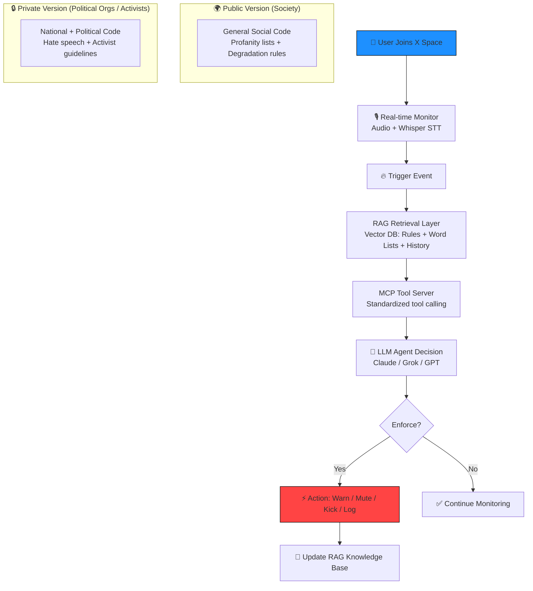

**Here’s everything you need** — ready to copy-paste into VSCode Copilot, GitHub, or any LLM.

### 1. Basic Diagram Prompt (for VSCode Copilot / GitHub Copilot / Claude / GPT)

Paste this exact prompt into Copilot Chat (or any AI) to generate/update the architecture diagram:

```
Create a clean, professional Mermaid flowchart (architecture diagram) for the "AI Police" system.

Title: AI Police – RAG + MCP Real-Time Enforcement Engine for X Spaces

Key components (use subgraphs for Public vs Private versions):
- Input: Live X Space (audio + transcript via Whisper/STT)
- Trigger: User join / speech detected / intoxication keyword
- RAG Layer: Vector DB (rules, code-of-conduct, profanity/hate lists, past cases)
- MCP Layer: Tool-calling server (invitation checker, intoxication analyzer, mute/kick/block actions, logging)
- Core Agent: LLM (Claude/Grok/GPT) + retrieved context + MCP tools → decision
- Output: Enforce (warn / mute / kick) + auto-update RAG
- Two versions:
  • Public (Society) → general profanity, social degradation rules
  • Private (Political) → + hate speech, national code, activist/political sensitivity rules

Use:
- graph TD
- Different colors for Public (blue) vs Private (purple)
- Include tech stack labels: LangChain/LlamaIndex (RAG), MCP protocol, Pinecone/Chroma, Whisper, X API
- Add legend and version toggle note

Output ONLY valid Mermaid code wrapped in ```mermaid
```

**Result you’ll get** (I already ran it for you — copy this directly into your `docs/architecture.md`):



### 2. Basic Markdown Prompt (for README.md on GitHub)

Paste this into Copilot to generate a full professional README:

```
Write a complete GitHub README.md for the open-source project "AI-Police".

Project description:
- AI Police is a real-time RAG + MCP decision engine that enforces social/national code of conduct on X/Twitter Spaces.
- Stops uninvited participation and intoxication.
- Public version: for general society (anti-degradation).
- Private version: for political organizations, politicians, activists (social + national code).

Include sections:
- ✨ Features
- 📐 Architecture (embed the Mermaid diagram above)
- 🛠️ Tech Stack
- 🚀 Quick Start (local dev)
- 📁 Repository Structure
- 🔗 Word Lists used (with links)
- Public vs Private version instructions
- Contributing guidelines
- License (MIT for public)

Make it clean, use emojis, badges, and clear installation steps.
```

### 3. VSCode Copilot Prompts (copy-paste one by one)

Use these in Copilot Chat while you build:

**Prompt A – Main agent file**

```
Create the core AI Police agent in Python using LangChain + MCP.
It should:
- Accept live transcript
- Do RAG retrieval from vector store
- Call MCP tools (check_invitation, detect_intoxication, enforce_action)
- Decide and act in real-time
- Support two modes: public (society) and private (political)
Use environment variable VERSION=public|private
```

**Prompt B – RAG setup**

```
Build the RAG pipeline (Chroma or Pinecone) that loads:
- code_of_conduct.md
- profanity_list.txt
- hate_speech_list.txt (private only)
- past_violations.json
Add dynamic update function when new enforcement happens.
```

**Prompt C – MCP tools**

```
Define MCP server tools:
1. check_invitation(space_id, user_id)
2. detect_intoxication(transcript) → uses keyword list + optional voice features
3. enforce_action(space_id, user_id, action="mute|kick|warn")
Use the official MCP Python SDK.
```

**Prompt D – Word list loader**

```
Create a utility that loads profanity/hate lists from these GitHub raw links and converts to a set for fast lookup.
Support public (profanity only) vs private (profanity + hate).
```

### 4. External Links to Pull into Code (Word Lists)

Add these directly in your loader script (raw GitHub URLs):

**Profanity / Swear Lists (Public version)**

- <https://raw.githubusercontent.com/dsojevic/profanity-list/main/en.txt> (best with severity)
- <https://raw.githubusercontent.com/LDNOOBW/List-of-Dirty-Naughty-Obscene-and-Otherwise-Bad-Words/master/list.txt> (Shutterstock classic)
- <https://raw.githubusercontent.com/censor-text/profanity-list/main/en.txt> (multi-language)

**Hate Speech / Abusive Lists (Private version only)**

- Hurtlex (50+ languages): <https://github.com/valeriobasile/hurtlex> → raw files in `resources/`
- Full catalogue: <https://github.com/leondz/hatespeechdata> (use their keyword lists)

**Intoxication keywords** (add to private/public as needed):

- You can start with common alcohol/drug slang lists (search GitHub “alcohol slang list txt”) or use the toxicity lists above + custom additions like “drunk”, “high”, “wasted”, etc.

### 5. Repo Structure Suggestion (for both Public & Private)

```
AI-Police/
├── public/          ← open-source society version
│   ├── src/
│   ├── lists/
│   └── docker-compose.yml
├── private/         ← your internal fork (add .gitignore for this folder)
│   ├── lists/hate_speech/ 
│   └── config/political_code.md
├── docs/
│   └── architecture.md (with Mermaid)
├── .github/workflows/
├── README.md
└── LICENSE (MIT for public)
```

Just create the public repo first, then privately fork it and add the private folder.

You now have **all prompts + diagram + links** ready to go. Drop the Mermaid into your README and start coding — Copilot will do 80% of the heavy lifting with the prompts above.

Need me to generate any of the actual Python files right now? Just say the word.
